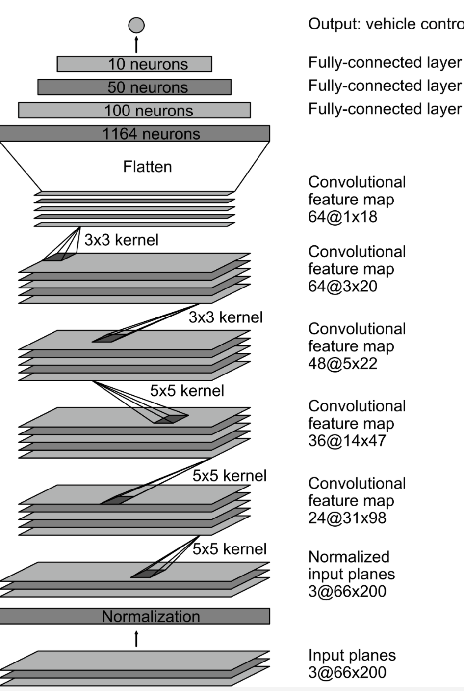
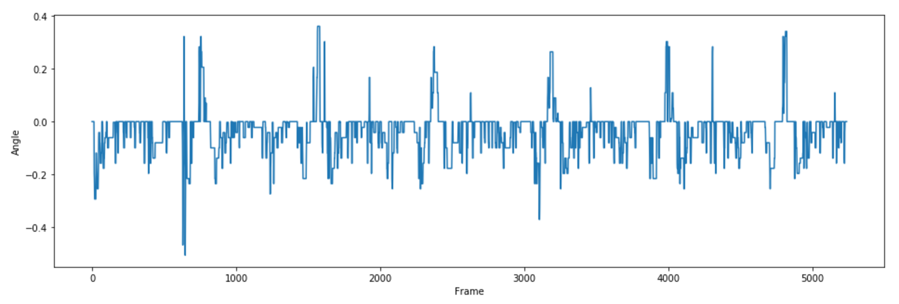
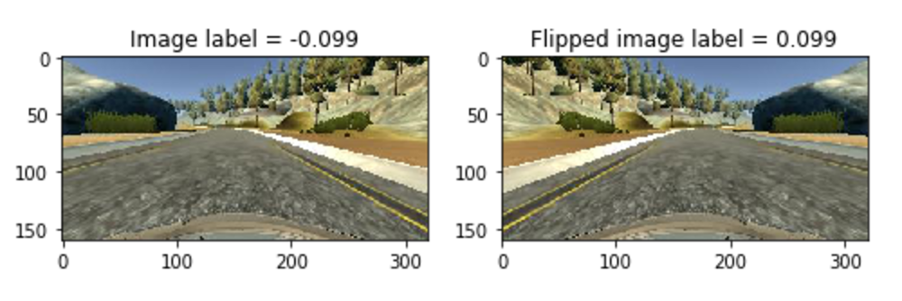
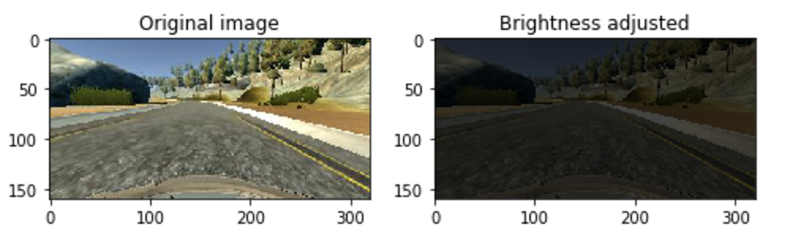
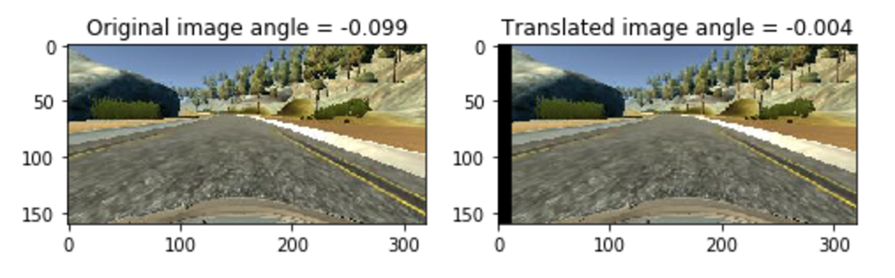
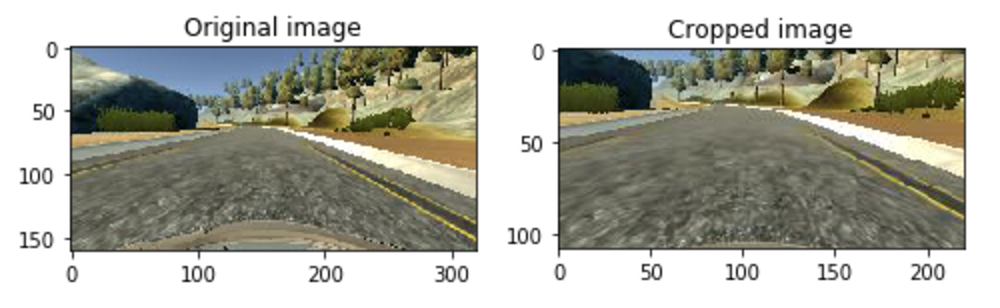
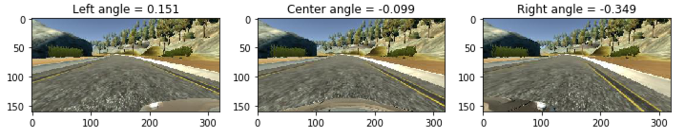

# Behavioral Cloning, Udacity SDC P3

## The Project

The goal of this project is to:

- Use the simulator to collect data of good driving behavior
- Build, a convolution neural network in Keras that predicts steering angles from images
- Train and validate the model with a training and validation set
- Test that the model successfully drives around track one without leaving the road
- Summarize the results with a written report

## Rubric points

### Here I will consider the rubric points individually and describe how I addressed each point in my implementation.

---

#### 1. Required files

This repository includes:

- The model.py file in which you will find my model organized and commented
- The results/drive.py file in which you will find the drive.py file which I used to predict the angles in the autonymous mode of the simulator
- The results/model.h5 and results/model.json file which represent the weights of the best model I trained (EPOCH 7)
- This readme.md file
- A jupyter notebook which shows my progress before I moved it to the model.py file

#### 2. Functional code

To run my trained network please run the following code:

```
cd ./results
python drive.py model.json
```

Using the simulator provided by Udacity in autonymous mode this should complete the track.

#### 3. Usable and readable code

You can find my model pipeline in model.py. It's clearly commented so it should be clear how the code works.

#### 4. Model architecture overview

I have chosen the [NVIDIA architecture](http://images.nvidia.com/content/tegra/automotive/images/2016/solutions/pdf/end-to-end-dl-using-px.pdf) which is mentioned in the Udacity Project description (Behavioral cloning part 6). I have added dropout to every layer of the network as well as a L2 regulizer to the first convolutional layer.

- Following the NVIDIA paper my model has 3 convolutional layers with a 5x5 filter and a 2x2 stride (line 172 - 184)
- Followed by 2 convolutional layers with a 3x3 filter and a 1x1 stride (line 186 - 194)
- Followed by a flat layer (line 197)
- Followed by three fully connected layers of sizes 100, 50 and 10 (line 199 - 211)
- It ends with a sized 1 output layer (the steering angle, line 214)
- Activation was done with ELU layers (line 173, 178, 183, 188, 193, 201, 206, 211)
- As per directions in the NVIDIA paper I have added a Keras Lambda layer to normalize the HSV image (line 169)

#### 5. Measures to reduce overfitting

- Dropout was added after every layer, except between the last fully connected layer and the output layer (line 174, 179, 184, 189, 194, 202, 207)
- A L2 regularizer was added to the first convolutional layer 172

#### 6. Parameter tuning

An Adam optimizer was used (line 226) so manual tuning of the learning rate was not necessary. The batch size, keep probability and regulization value where tuned by trial and error (line 156 - 160)

#### 7. Choosing the training data

To generate the training data I first of all acquired a joystick (for smoother angles). I tried keeping the car in the middle of the road as much as possible (so no recover lines from the sides). For the recovery training I used the left and right camera's (as described in the NVIDIA article). By randomly switching between the center, left and right camera and adding an angle of 0, +.25 and -.25 respectively the car learned how to drive in the middle of the road. More details on processing the training data are given in point 10.

#### 8. Solution design

After going through the basics of the project in the Udacity Classroom I headed to the forum, where I found links to blogs of several co-students who had already finished the project. Their enthusiasm of the NVIDIA network, as well as the fact that it was mentioned in the Udacity project description led me to believe it would be a good starting point. I started reading the [paper](http://images.nvidia.com/content/tegra/automotive/images/2016/solutions/pdf/end-to-end-dl-using-px.pdf) and the [blog post](https://devblogs.nvidia.com/parallelforall/deep-learning-self-driving-cars/) and was able to deduct the basic setup from there.

I started by normalizing the data, shuffeling it and splitting it into train and validation data (80%/20%). I did this on a small amount of data and quickly noticed that the loss quickly leveled out indicating the network was overfitting. To combat the overfitting I knew I needed more data and I needed to add extra measures to prevent it.

In order to generate more data I started using a generator and to combat the overfitting I made use of dropout and a L2 regulizer.

I could then drive the car around the track, where it had a lot of trouble with the first sharp bend to the right (near the water). The training was bias to smaller angles and therefor had trouble with the larger angles. I also ran into a unique problem where sometimes after training the angle prediction would be static (same angle no matter what image was fed to predict), this was because I accidentaly forgot the activation layers (stupid). After correcting this mistake and ignoring angles smaller than .15 (negative and positive; line 128) I ended up with the car being able to complete track 1.

#### 9. Model architecture

The final model (lines 164 - 214) consists out of 5 convulutional layers (3 times a 5x5 filter and 2 times a 3x3 filter) and 3 fully connected layers as described in the NVIDIA paper. It takes in images of the shape (66, 200, 3) in a HSV color space. Graphically the network looks like this:


__taken from the NVIDIA paper__

#### 10. Creation of training data

Before I started with the process of creating training data in the generator I first excluded the training data where the throttle value was lower than .2 and plotted this data in a histogram. The histogram clearly shows that there is more training data with a negative steering angle (turning left).



The histogram shows we will need to generate flipped images to compensate for the bias data. Step two was creating a set of augmentation steps. I decided to add the following:

*Flipping the image and the angle (line 60 - 62)*

This makes sure there is an equal balance between left and right turns.



*Adjusting the brightness randomly*

To make sure the network is not trained for specific brightness and performs well under different or changing lighting. To do this I converted the image to the HSV color space and randomly added a value to the 3rd Value layer of the HSV space (line 64 - 70).



*Jitter the image and add or subtract a steering angle*

I jittered the images randomly to compensate for the jitter in steering angles. I have only translated the images horizontally (line 72 - 82)



*Crop the image*

Finally I cropped the image (line 84 - 86). I have taken off 1/5th of the top, to get rid of the sky, and 20 pixels of the bottom, to get rid of the hood. I also cropped the image width by the amount of the translation (50 pixels of the left side). I then resized the images to 200 x 66 pixels as was recommended in the NVIDIA paper.



*Random choice of left, right or center camera*

To train the car to steer back towards the center of the road, I have trained the network with randomly chosing the left, right or center camera. If the left camera is chosen .25 is added to the steering angle (to steer it back to the right), if the right camera is chosen -.25 is added to the steering angle.



All adjustments are put together in the processImage function (line 93 - 106) which has a train parameter. Setting this to true generates training data (with jittering and flipping), setting it to false generates validation data (only crop and resize). The images processing is called upon by the train generator (line 108 - 137) and the validation generator (line 139 - 153). At the end of the training generator the data is randomly shuffled.

I ended up creating 24064 samples of training data per epoch and 4608 samples of validation data per epoch. I stored the model per epoch to be able to compare the different epochs on the track. Eventually epoch 7 performed best and was saved as model.json and model.h5.

#### 11. To be continued....

There is still room for improvement. Augmenting shadows, smoothening out the training data, introducing more recovery data are all ways of improving the performance of the model in the real world. I am planning on exploring some of these methods now on my own to see how far I can increase the performance of the model. I will add the results as a seperate branch to this repo.
